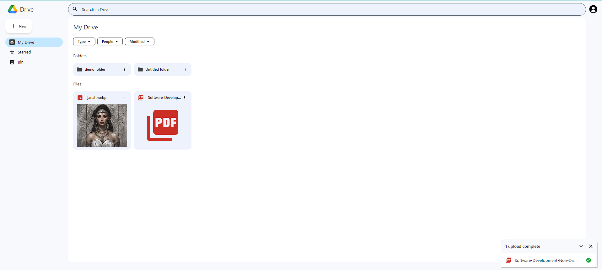
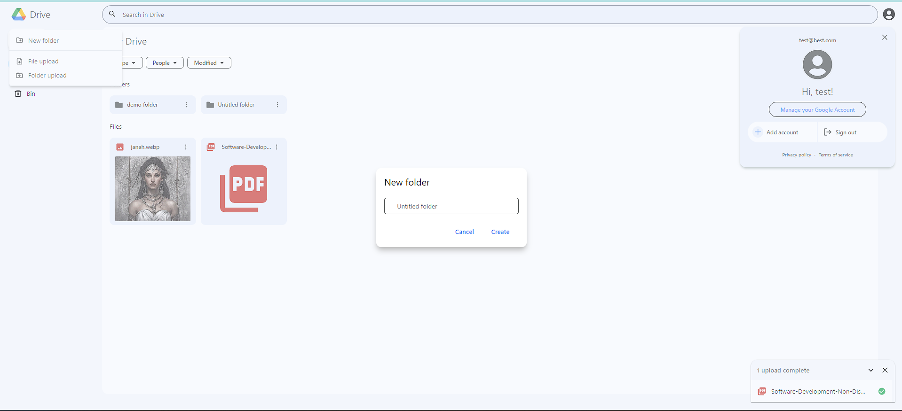
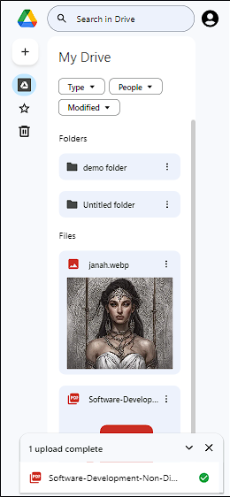

Here's the updated README for the "Over Drive" project with the requested changes:

---

#  Over Drive 

Over Drive is a cloud storage and file management platform, designed to provide users with a seamless and efficient experience, replicating core functionalities of [Google Drive](https://drive.google.com/drive/my-drive). It integrates AI-powered features to enhance search and file organization, making file management faster and smarter. Built with modern web technologies, Over Drive offers a responsive and user-friendly interface across devices.

### Demo

### Features

- **User Authentication**: Secure user accounts are managed through NextAuth.js for simple and protected login experiences.

- **File Upload and Management**: Users can upload and manage files effortlessly, providing a solution for storing documents, media, and other files.

- **AI-Powered File Search**: Find files quickly with an AI-enhanced search function that looks through filenames and even the content within files, providing fast and accurate results.

- **Quick Reorganization**: A smart file organization option that automatically sorts and groups files by type, organizing images, music, documents, and other categories together for easier access.

- **Folder Navigation**: Users can create folders, organize files, and navigate through the directory structure with ease.

- **Responsive Design**: The UI is fully responsive, ensuring a smooth experience on any device, including desktops, tablets, and mobile devices.

### Technology Stack

**Next.js** | **TypeScript** | **Tailwind CSS** | **React** | **Vercel** | **Firebase** | **NextAuth.js** | **sqlite**  | **Prisma ORM** 

### How to Run

To run the project locally, follow these steps:

1. Clone the repository to your local machine.
2. Install the required dependencies using `npm install`.
3. Create a Firebase project and configure it for this application.
4. Set up authentication and real-time database in Firebase.
5. Configure the environment variables in `.env` (check [.env.example](./.env.example)).
6. Start the development server using `npm run dev`.

The application should now be running on your local environment. You can access it at [http://localhost:3000](http://localhost:3000).

### Issues and Feedback

If you encounter any issues with the application or have feedback, feel free to open an issue on the project's GitHub repository.

## Branches

- **contributors** -> Submit your pull requests to this branch.
- **main** -> This is the production branch; avoid making changes here.

### Contributing

Contributions are welcome! Please open an issue or submit a pull request.

### License

MIT

---

This updated README includes the AI-powered features for file search and quick reorganization, and it retains the original structure with improved clarity.